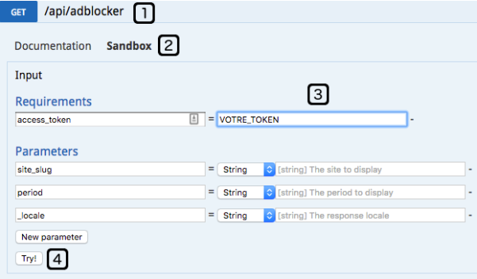

Online Documentation
====================
.. NOTE::
In the examples, you should replace YOUR_TOKEN with your personal token.

* You can access API documentation from:

https://www.adback.co/api/doc?access_token=YOUR_TOKEN

* How-to use the sandbox

1. Choose an endpoint
2. Click on Sandbox
3. Put your token in access_token
4. Display the result of the request by clicking on Try!

