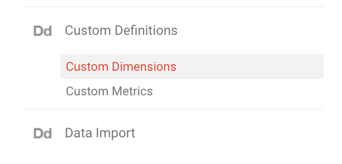
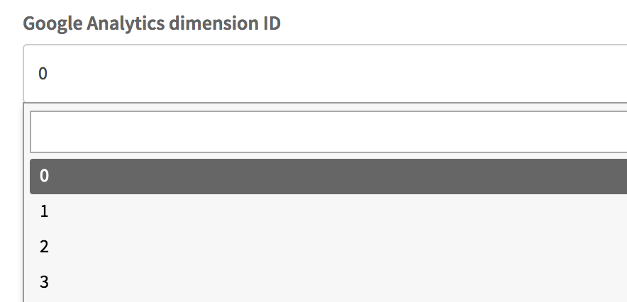

Add a Google Analytics Dimension
================================

* On Google Analytics side

1. Choose **ADMIN** on the left side menu
2. On the **PROPERTY** menu, click **Custom Definitions** then **Custom Dimensions**

3. Add a dimension and choose the **Session** Scope
4. Get the dimension id

* On AdBack.co side:

1. Go to https://www.adback.co/en/admin/config
2. Click on **Edit website**
3. Select the dimension id previously created

4. Save by clicking on **Edit website**