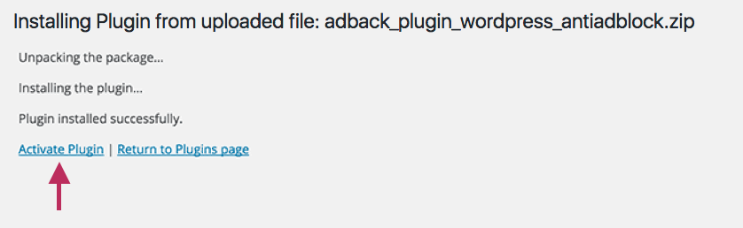

FAQ
===

Qu’est ce qu’AdBack ?
---------------------
AdBack est une solution professionnelle d’analyse de votre audience Internet utilisatrice de bloqueurs de publicités. Elle comptabilise, décrypte et vous alerte de l’évolution de cette audience. Elle vous permet de réagir, d’informer et de monétiser cette audience spécifique.

Qu’est-ce qu’un internaute bloquant la publicité ou utilisateur d’adblocker ?
-----------------------------------------------------------------------------
Aujourd’hui, différents moyens existent pour bloquer la publicité. Un utilisateur d’adblocker est un internaute utilisant une des solutions ci-dessous :
une extension de navigateur : plusieurs extensions existent telles que Adblock Plus, AdBlock, Ghostery, uBlock, uBlock Origin ou encore Crystal sur mobile iOS
un antivirus
un firewall personnel via son antivirus
un firewall professionnel via son entreprise

Pourquoi installer AdBack ?
---------------------------
En installant AdBack, vous avez accès à un outil hautement technologique non détecté par les adblockers, à des informations en temps réel, à un script maximisé et en constante évolution ainsi qu’à un panel de solutions pour s'adresser à l’audience utilisatrice d’adblocker.

Quel bénéfice puis-je tirer de l’utilisation d’AdBack ? 
-------------------------------------------------------
Grâce à AdBack, apprenez à comprendre vos utilisateurs d’adblocker et à renouer le dialogue avec eux. Avec AdBack, récupérez de 28 à 60% de vos revenus publicitaires perdus à cause des adblockers.

A qui s’adresse AdBack ?
------------------------
AdBack s’adresse à tous éditeurs de contenu qui cherchent à comprendre et monétiser leur audience bloquée : sites média, régionaux, blogueurs. AdBack s’adresse également à tous les sites e-commerçants, annonceurs, agences qui veulent auditer leur site, vérifier en temps réel que les utilisateurs d’adbocker n’impactent pas le taux de conversion et utiliser des outils de génération de leads spécifiques sur cette audience.

Comment installer la solution AdBack sur son site ?
---------------------------------------------------
Si vous possédez un site WordPress, référez-vous à la section : plugin AdBack sur WordPress.

Si vous n’êtes pas détenteur d’un site WordPress, créez un compte en cliquant sur “`Tester AdBack`_” sur la page d’accueil ou en choisissant la formule de votre choix dans la section prix.
Ensuite, référez-vous à notre documentation technique (http://docs.adback.co/en/latest/) pour intégrez l’API d’AdBack afin de commencer à collecter les données. Une fois cette intégration réalisée, vous pourrez commencer à analyser vos données depuis votre dashboard AdBack. Si vous rencontrez des difficultés, contactez notre support à support@adback.co. 

Quels sont les différents plugins disponibles ?
-----------------------------------------------
Plugin AdBack sur WordPress
AdBack propose une solution clés en main très simple d’utilisation pour tous les détenteurs d’un site WordPress. Le plugin AdBack est téléchargeable gratuitement ici_. Il permet à tous les détenteurs de site WordPress d’utiliser la solution AdBack directement depuis l’interface WordPress où les principales données seront affichées. L’utilisateur peut  également accéder à tout moment à toutes les statistiques détaillées sur son dashboard AdBack.

Comment installer le plugin AdBack sur WordPress ?
--------------------------------------------------
1) Téléchargez le plugin ici_.

2) Connectez-vous à votre interface WordPress en mode admin et rendez vous dans la partie “Plugins” “Add new” puis cliquez sur “Upload Plugin” en haut de la page

.. image:: img/wordpress_addplugin1.png

3) Vous pouvez uploader depuis votre ordinateur le plugin AdBack précédemment téléchargé en cliquant sur “choose file”. Choisissez le fichier zip “adback_plugin_wordpress_antiadblock.zip”

.. image:: img/wordpress_addplugin2.png

4) Une fois le fichier sélectionné, cliquez sur “Install now”. WordPress va installer le plugin. Une fois installé, cliquez sur “Activate Plugin”.

5) Le plugin est finalement installé. Vous avez désormais un onglet AdBack sur votre interface WordPress avec une partie statistiques où vous trouverez les principaux graphiques et une partie settings où vous pourrez programmer et personnaliser les messages à afficher à vos utilisateurs d’adblocker. Sur WordPress, vous avez accès aux fonctionnalités et statistiques de base. Pour accéder aux statistiques détaillées et à des fonctionnalités poussées de configuration du message, rendez vous sur votre `dashboard sur AdBack`_. 

.. image:: img/wordpress_addplugin4.png

Drupal
------
Bientôt disponible. 

Magento
-------
Bientôt disponible.

PrestaShop
----------
Bientôt disponible.

Quelles sont les modalités techniques du tag AdBack ?
-----------------------------------------------------
- Le tag se charge en mode asynchrone, c’est à dire que le contenu de la page se charge distinctement du tag AdBack
- Seulement 2 appels serveur générés par le tag AdBack 
- Poids du dossier JavaScript : 9,5 ko et moins de 500 octets
- Une réponse en fonction de la situation géographique : livraison par un réseau CDN international hébergé par Amazon Web Services
- Auto-détection de HTTP/HTTPS, support des nouveaux protocoles jusqu’à SPDY/3.1
- Data warehouse hébergé sur Amazon Redshift , capable de gérer et analyser des pétaoctets de données en quelques secondes

En quoi la solution AdBack est-elle différente des autres solutions sur le marché ?
-----------------------------------------------------------------------------------
AdBack propose une palette de statistiques large et complète. Notre force repose sur une technologie solide, à la pointe de l’innovation et impossible à bloquer par les adblockers. Alors que la plupart de nos concurrents tentent de forcer le passage des publicités, nous souhaitons trouver des solutions alternatives durables pour réconcilier les éditeurs et les utilisateurs afin de contribuer à développer l’Internet de demain.

AdBack possède-il des connections avec d’autres outils ?
--------------------------------------------------------
Pour que la data vive, elle se doit d’être disponible dans tous les outils de web analytics existants. C’est pour cela que nous ouvrons des connections avec les principaux outils du marché (analytics, DMP, ad servers…)  

A quelles données analytiques ai-je accès grâce à AdBack ?
----------------------------------------------------------
Vous avez accès à de nombreuses données en temps réel telles que le type de navigateur et le type de bloqueur utilisé par vos internautes. Vous saurez également s’ils naviguent sur mobile ou desktop, et connaîtrez quelle proportion de vos outils analytics est bloquée (Google Analytics, Xiti…) par les adblockers. Vous accéderez également à de nombreuses autres statistiques.

Qu’est ce le message personnalisé ?
-----------------------------------
Le message personnalisé est le pop-in qui apparaît sur l’écran des utilisateurs d’adblocker. Le message peut être différent selon le profil de l’internaute ciblé. Il peut s’accompagner de fonctionnalités de désactivation de l’adblocker ou de différentes alternatives à la publicité.

Quelles sont les différentes alternatives à la publicité proposées par AdBack ?
-------------------------------------------------------------------------------
Nous proposons :
- De répondre à des sondages
- Une solution de micro-paiement
- Une inscription à une newsletter
- Le visionnage d’une vidéo publicitaire pour accéder un contenu

AdBack, c’est gratuit ?
-----------------------
Tout le module analytics d’AdBack est gratuit et accessible à tous. Seul l’affichage du message personnalisé avec les fonctionnalités de désactivation ou d’alternative est payant. Pour connaître les différentes formules, référez-vous à la partie “Prix” du site.

.. _Tester AdBack: https://www.adback.co/fr/register/
.. _ici: https://www.adback.co/adback_plugin_wordpress_antiadblock.zip
.. _dashboard sur AdBack: https://www.adback.co/en/sites/dashboard
